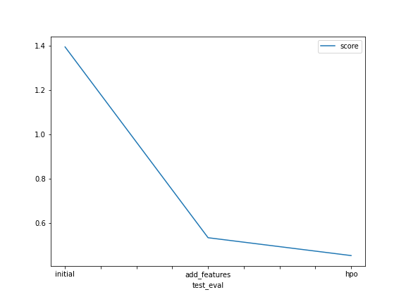

# Report: Predict Bike Sharing Demand with AutoGluon Solution
#### CHARALAMPOS SARANTOGLOU

## Initial Training
### What did you realize when you tried to submit your predictions? What changes were needed to the output of the predictor to submit your results?
Kaggle gives a score of 'None' and a status of 'error' to submissions that contain predictions with negative values. The negative values had to be set to 0 before submitting the predictor results.

### What was the top ranked model that performed?
WeightedEnsemble_L3 was the top performer in the 1st and 3rd runs. WeightedEnsemble_L2 was the top performer in the 2nd run.

## Exploratory data analysis and feature creation
### What did the exploratory analysis find and how did you add additional features?
As expected, we had an equal amount of data for all seasons, less data for holidays, more data for working days. Data decreased as weather became worse or wind increased or temperature or humidity became too low or too high. I added a feature to explore how time affected rentals by extracting the hour from the 'datetime' feature.

### How much better did your model preform after adding additional features and why do you think that is?
It performed extremely better (the kaggle score decreased from 1.39482 to 0.53253). This indicates that the number of rentals depends heavily on the time of day.

## Hyper parameter tuning
### How much better did your model preform after trying different hyper parameters?
It performed significantly better (the kaggle score decreased from 0.53253 from 0.45185) after increasing the time limit and enabling the bagging of models and stack ensembling.

### If you were given more time with this dataset, where do you think you would spend more time?
I would probably try to improve individual model hyperparameters for the top ranked models.

### Create a table with the models you ran, the hyperparameters modified, and the kaggle score.
|model|time|num_bag_folds|num_stack_levels|score|
|--|--|--|--|--|
|initial|600|0|0|1.39482|
|add_features|600|0|0|0.53253|
|hpo|1500|5|2|0.45185|

### Create a line plot showing the top model score for the three (or more) training runs during the project.

### Create a line plot showing the top kaggle score for the three (or more) prediction submissions during the project.

## Summary
The predictions improved with the addition of an important feature and hyper parameter optimization.
